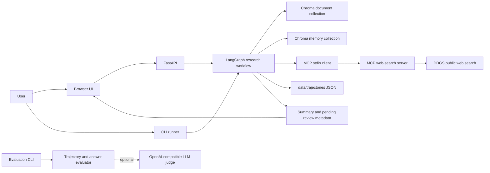
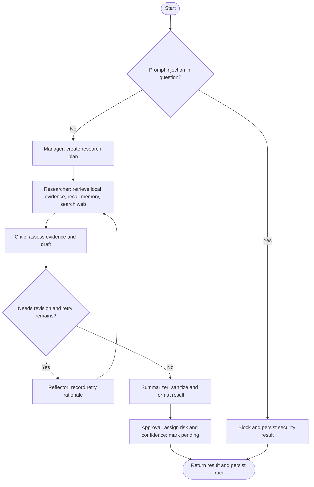

# Multi-Agent Research Assistant

A source-grounded research application that coordinates specialized workflow nodes to gather local and web evidence, recall prior supported research, assess answer coverage, and route every result for human review. The project includes a browser interface, a FastAPI service, a command-line runner, a persistent Chroma knowledge store, an MCP web-search server, trace persistence, and an evaluation package.

## Contents

- [Overview](#overview)
- [Capabilities](#capabilities)
- [Architecture](#architecture)
- [Multi-agent workflow](#multi-agent-workflow)
- [Evidence, memory, and trace data](#evidence-memory-and-trace-data)
- [Security and human review](#security-and-human-review)
- [Getting started](#getting-started)
- [Configuration](#configuration)
- [Using the application](#using-the-application)
- [Evaluation](#evaluation)
- [Project layout](#project-layout)
- [Operational notes and limitations](#operational-notes-and-limitations)

## Overview

The assistant accepts a research question and runs a directed workflow implemented with [LangGraph](https://docs.langchain.com/oss/python/langgraph/overview). It retrieves relevant passages from a local Markdown corpus, recalls provenance-bearing notes from prior supported runs, and gathers current public-web results through a separate [Model Context Protocol (MCP)](https://modelcontextprotocol.io/) server. A critic checks whether the evidence is present and whether the draft contains known instruction-overwrite phrases. When evidence is missing, the workflow can retry retrieval within a bounded revision loop. A summarizer produces the result, and an approval node records a pending human-review decision with a risk and confidence estimate.

The system is designed to make research steps inspectable. Each run records ordered node and tool events, a trace identifier, a compact trace summary, and a JSON trajectory on disk. The current agent nodes are deterministic Python functions: they coordinate retrieval and evaluate evidence; they do not call a generative model to compose or reason over the answer. The optional language-model integration belongs to the evaluation judge only.

## Capabilities

- **Local retrieval-augmented generation (RAG):** Markdown files are chunked and embedded locally using Sentence Transformers (`all-MiniLM-L6-v2`), then stored in a persistent Chroma collection with cosine distance.
- **Public web search over MCP:** The workflow calls a standalone stdio MCP server, which exposes a `web_search` tool backed by `ddgs`.
- **Persistent research memory:** Supported runs write a short source-aware note to a separate Chroma collection. Similar notes can be recalled on later runs.
- **Evidence critique and bounded retry:** A critic flags absent local or web evidence, empty drafts, and known prompt-injection patterns. Missing-evidence cases can loop through reflection and a second research pass.
- **Prompt-injection screening:** Known instruction-overwrite attempts are checked before gathering evidence, and draft text is checked and sanitized before presentation.
- **Human-review metadata:** Results are marked pending human approval and include risk, confidence, and a short preview. The project does not currently implement an approval UI or approval-decision endpoint.
- **Traceability:** Tool and node events are saved to `data/trajectories/` as JSON, with per-run identifiers and aggregate event timing/counts.
- **Multiple entry points:** Use the web UI and API, the command-line research runner, or the evaluation command.
- **Container support:** Docker and Docker Compose configuration is included for running the API and browser UI.

## Architecture



### Main components

| Component | Responsibility |
| --- | --- |
| `src/research/workflow.py` | Defines the workflow state, screening and sanitization helpers, agent nodes, graph routing, MCP client call, trace events, and run persistence. |
| `src/research/config.py` | Reads retrieval settings and resolves the configured web-search callable. |
| `src/rag/` | Chunks and indexes local Markdown documents and retrieves semantically similar passages. |
| `src/research/memory.py` | Stores and retrieves short source-aware notes in a collection separate from the document corpus. |
| `src/mcp_server/server.py` | Exposes public web search as the MCP `web_search` tool over stdio. |
| `src/api.py` and `static/index.html` | Provide the HTTP API and single-page browser interface. |
| `src/eval/` | Builds evaluation cases, checks evidence and trajectory criteria, and optionally adapts an OpenAI-compatible model as judge. |

## Multi-agent workflow

The workflow uses a shared `ResearchState` and explicit LangGraph edges. Each node appends a timestamped event to the trajectory, so the saved record shows what was called and the sequence in which the work occurred.



### Node responsibilities and routing

1. **Security screening** runs before graph execution. If a known prompt-injection pattern is found in the question, research is stopped, a blocked result is constructed, and a security event is persisted.
2. **Manager** creates a four-step plan: identify scope, retrieve local evidence, search for current web context, and draft with evidence sources distinguished.
3. **Researcher** retrieves the configured number of local chunks, recalls relevant memory notes, and invokes the web-search callable. Web-search failures are captured in the trajectory and treated as no web results, allowing the workflow to finish with the available evidence. The current draft is a structured compilation of the question and retrieved text; it is not generated by an LLM.
4. **Critic** checks for local and web evidence, an empty draft, and instruction-overwrite patterns. It marks the draft `supported`, `needs_revision`, or `blocked` and records weaknesses and evidence counts.
5. **Reflector** records a retry rationale and increments the revision counter. It routes back to the researcher. A missing-evidence draft can be retried while the revision count is below two; the graph then continues to summarization even if the evidence remains incomplete.
6. **Summarizer** sanitizes known instruction-overwrite phrases. If the original draft contained a detected pattern, it replaces the draft with a security-blocked message. It also includes the critic's status and weaknesses.
7. **Approval** always sets `needs_approval` and records `pending_human_approval`. Risk and confidence are based on evidence counts and injection signals. This step records a review requirement; it does not pause execution for an interactive approval or publish an approval decision.

Supported runs save a short memory note with the question and the first local and web source identifiers. Unsupported or blocked runs do not add a memory note.

## Evidence, memory, and trace data

### Knowledge base

Place Markdown knowledge sources in `data/documents/`. Ingestion splits text at paragraph boundaries into chunks of approximately 700 characters, embeds them using `all-MiniLM-L6-v2`, and recreates the `research-assistant-documents` Chroma collection. Source filenames and chunk indices are stored as metadata. Retrieval returns the text, source filename, and cosine distance.

The repository includes short guides on retrieval, memory, and evaluation as initial sample documents. These can be replaced or supplemented with project-specific reference material.

### Long-term memory

Research memory is stored in a distinct `research-assistant-memory` Chroma collection under the same persistent data directory. A note is saved only when the critic marks a run as supported. Recalled memory is included in the research draft as a separate evidence category so it remains distinguishable from newly retrieved local and web sources.

### Trajectories

Each run writes a JSON file under `data/trajectories/`. The record includes the question, plan, retrieved results, draft, critique, summary, security and approval metadata, ordered events, trace ID, and trace summary. The trace summary includes event counts, first and last events, timestamps, and duration. Treat this directory as potentially sensitive if research questions or source excerpts contain confidential information.

## Security and human review

The workflow includes lightweight safeguards: a pattern-based check on the incoming question, a critic check over the assembled draft, output sanitization, and risk assignment in the approval metadata. These checks target a known list of instruction-overwrite phrases; they are not a general-purpose content-safety classifier or a guarantee against prompt injection. Web pages and retrieved passages should still be treated as untrusted input.

The result is always marked as requiring human review. The API returns the summary and review metadata, while the browser presents the summary, risk, confidence, trace event count, and duration. A person must review the result through an operational process outside this application's current API; no approval action is implemented.

## Getting started

### Requirements

- Python 3.12 or a compatible Python version for the installed dependencies.
- Network access for installing dependencies, downloading the embedding model on first use, and public web search.
- Sufficient disk space for the Python packages, embedding model, and persistent Chroma data.

### Install and index documents

From the repository root, create and activate a virtual environment, then install the project dependencies:

```powershell
python -m venv .venv
.\.venv\Scripts\Activate.ps1
python -m pip install --upgrade pip
pip install -r requirements.txt
```

Index the Markdown files in `data/documents/`:

```powershell
python -m src.rag.ingest
```

Ingestion replaces the document collection contents. Run it again after changing the corpus. The memory collection is separate and is not reset by document ingestion.

### Run the API and browser UI

```powershell
uvicorn src.api:app --reload
```

Open [http://127.0.0.1:8000](http://127.0.0.1:8000) for the browser UI. The interactive API documentation is available at [http://127.0.0.1:8000/docs](http://127.0.0.1:8000/docs), and the health endpoint is [http://127.0.0.1:8000/health](http://127.0.0.1:8000/health).

### Run a question from the command line

```powershell
python -m src.research.run "What is hybrid retrieval?"
```

The command prints the draft and critic review. The full run and trajectory are saved under `data/trajectories/`.

### Run with Docker Compose

Build and start the API and browser UI:

```powershell
docker compose up --build
```

The service listens on port `8000`. Compose mounts `data/chroma` and `data/trajectories` from the host for persistence. Index the local documents before asking questions; the Compose configuration does not run ingestion automatically. Depending on the Docker image and host platform, dependencies may download during image build and the embedding model may download on first use.

## Configuration

Configuration is read from environment variables. A local `.env` file is loaded by the evaluation command; the API and workflow read process environment variables directly. Keep credentials out of version control.

| Variable | Default | Purpose |
| --- | --- | --- |
| `RESEARCH_RAG_TOP_K` | `2` | Number of local document chunks retrieved per research pass. |
| `RESEARCH_MEMORY_TOP_K` | `2` | Number of prior memory notes recalled per pass. |
| `RESEARCH_WEB_MAX_RESULTS` | `5` | Maximum web results requested by configuration. |
| `RESEARCH_WEB_PROVIDER` | `default` | Set to `none` to disable external search. |
| `NVIDIA_API_KEY` | — | API key for the optional NVIDIA NIM compatible evaluation judge. |
| `NVIDIA_BASE_URL` | `https://integrate.api.nvidia.com/v1` when using `NVIDIA_API_KEY` | Optional base URL for the NVIDIA-compatible judge. |
| `NVIDIA_MODEL` | `z-ai/glm-5.3` | Optional model name for the NVIDIA-compatible judge. |
| `OPENAI_API_KEY` | — | API key for an optional OpenAI-compatible evaluation judge. |
| `OPENAI_BASE_URL` | Provider default | Optional endpoint for an OpenAI-compatible judge. |
| `OPENAI_MODEL` | `z-ai/glm-5.3` | Optional model name for the OpenAI-compatible judge. |

The web-search results limit used by the current MCP client is five. `RESEARCH_WEB_MAX_RESULTS` is included in settings and trace metadata but is not currently passed through to the MCP call, which uses its own five-result default. The `none` provider disables search and therefore tends to produce a critic finding that web evidence is missing.

## Using the application

### HTTP API

`GET /health` returns a simple health status. `POST /research` accepts a JSON body with a non-empty question of up to 2,000 characters:

```json
{
  "question": "What is hybrid retrieval?"
}
```

The response includes the question, summary, `needs_approval`, security status, approval metadata, trace ID, and trace summary. It does not return the complete retrieved evidence or trajectory; those are available in the persisted JSON trajectory file.

### Browser interface

The single-page interface submits a question to `/research` and displays the research status, risk, confidence, event count, duration, and summary. Requests run synchronously from the browser's perspective; the interface displays a loading state until the workflow completes.

## Evaluation

The evaluation package provides retrieval, normal-question, and red-team cases; trajectory-order checks; answer grounding checks; and deterministic heuristic scoring. An optional OpenAI-compatible judge can score cases when configured. Run the suite with:

```powershell
python -m src.eval.run_eval
```

Write the detailed JSON report to a chosen path:

```powershell
python -m src.eval.run_eval --json-output data/eval/results.json
```

Select the optional LLM judge with `--judge llm` after setting the relevant provider environment variables:

```powershell
python -m src.eval.run_eval --judge llm
```

The default pass-rate thresholds are 0.9 for normal and retrieval cases and 1.0 for red-team cases. Thresholds can be adjusted with `--threshold-normal` and `--threshold-red-team`. The current CLI constructs sample trajectories and answers for the evaluation cases; it evaluates the scoring logic and suite behavior, rather than invoking the full research workflow for every case. LLM judge output should be reviewed and calibrated against human-labeled examples.

## Project layout

```text
.
├── data/
│   ├── documents/          # Markdown sources used to seed the local knowledge base
│   ├── chroma/             # Persistent document and memory collections (created at runtime)
│   └── trajectories/       # Per-run JSON research traces (created at runtime)
├── src/
│   ├── api.py              # FastAPI service
│   ├── eval/               # Evaluation suite, scoring, and optional LLM judge
│   ├── mcp_server/         # MCP web-search tool server
│   ├── rag/                # Document ingestion, Chroma storage, and retrieval
│   └── research/           # Workflow, configuration, memory, trace helpers, and CLI
├── static/                 # Browser UI
├── tests/                  # Workflow, retrieval, API, MCP, config, and evaluation tests
├── Dockerfile
├── docker-compose.yml
├── pyproject.toml
├── requirements.txt
└── README.md
```

## Operational notes and limitations

- Initialize the local document collection before a research run; retrieval raises an error when the index is empty.
- The local corpus and memory use persistent Chroma storage in `data/chroma/`. Back up or remove this directory according to your data-retention requirements.
- Public search depends on the availability of the `ddgs` provider and network access. A failed web search is recorded, and the remaining workflow continues without web results.
- The workflow draft is a structured evidence compilation and does not synthesize a fluent research response with a language model. The optional LLM judge is only used by evaluation.
- Critique is rule-based and checks for evidence presence and listed prompt-injection phrases. It does not assess factual correctness, source authority, or entailment comprehensively.
- The approval stage records a pending human-review state but does not implement approval or rejection actions.
- `data/trajectories/` can contain user questions and retrieved excerpts; handle and retain it with appropriate privacy controls.
- The repository includes tests under `tests/`. The GitHub Actions workflow installs dependencies and runs `pytest -q` on pushes to `main` and on pull requests.

## License

See [LICENSE](LICENSE) for license terms.
